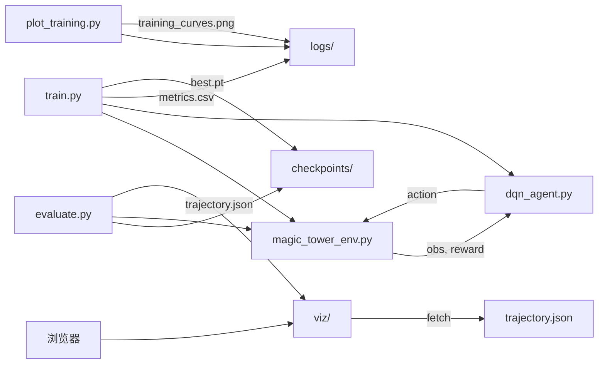

## 1. 问题形式化（MDP 建模）

- **状态** `s`：4 维归一化向量 `[HP/H0, d/D_max, money/M_max, killed/N]`，其中 `D_max=10`、`M_max=50`（仅用于归一化，不限制实际值）。
- **动作** `a ∈ {0, 1, 2}`：0=打下一只怪；1=加防御（钱够才有效）；2=回血（钱够才有效）。无效动作不改状态，给一个 `-0.1` 的小惩罚，避免 agent 反复选无效动作。
- **奖励** `r`（通关能否学出来的关键，谨慎设计）：
  - 杀 1 只怪：`+1`
  - 通关（`killed == N` 且 `HP > 0`）：`+50`
  - 死亡（打完怪 `HP <= 0`）：`-50`
  - 加防御 / 回血（钱够的合法操作）：`0`
  - 无效动作（钱不够还选买东西）：`-0.1`
- **终止**：胜利 或 死亡。
- **折扣** `γ = 0.99`。

参数来自 [instructions.md](instructions.md) 的 `CONFIG`，全部写成模块级常量，不对外暴露随机性。

## 2. 文件结构（严格控制，不过度设计）

```
magic_tower_rl/
├── requirements.txt          # 依赖清单
├── README.md                 # 使用说明：如何训练、评估、看回放
├── magic_tower_env.py        # Gymnasium 环境（复用原命名）
├── dqn_agent.py              # Q 网络 + ReplayBuffer + DQNAgent
├── train.py                  # 训练入口，保存 checkpoints/best.pt + logs/metrics.csv
├── evaluate.py               # 加载最优权重，贪婪跑一局，导出 viz/trajectory.json
├── plot_training.py          # 读 logs/metrics.csv 画 reward/loss/win_rate 曲线
├── viz/
│   ├── index.html            # 可交互回放页面（播放/暂停/步进/重置）
│   ├── viz.js                # 读取 trajectory.json 渲染动画
│   └── style.css
├── checkpoints/              # 训练生成（加 .gitignore）
└── logs/                     # 训练生成（加 .gitignore）
```

## 3. 核心模块要点

### `magic_tower_env.py`
- 继承 `gymnasium.Env`。
- `observation_space = Box(low=0, high=+inf, shape=(4,), dtype=float32)`。
- `action_space = Discrete(3)`。
- `reset()` 返回初始 obs：`HP=60, d=1, money=0, killed=0`。
- `step(a)` 按上面奖励规则推进状态；返回 `(obs, reward, terminated, truncated, info)`；`info` 带 `win: bool` 方便统计胜率。
- 内部保留未归一化的真实状态用于渲染；对外 obs 做归一化。

### `dqn_agent.py`
- `QNet`：3 层 MLP，`4 -> 64 -> 64 -> 3`，ReLU。
- `ReplayBuffer`：容量 50k。
- `DQNAgent`：
  - 两个网络：`online` 与 `target`，每 500 步硬同步。
  - ε-greedy，ε 从 `1.0` 线性衰减到 `0.05`（前 5000 步衰减完）。
  - 优化器 Adam，`lr=1e-3`；`batch=64`；`γ=0.99`；Huber loss。

### `train.py`
- 默认训练 `3000` 个 episode（状态空间很小，通常几百局就能学会，3000 留足余量）。
- 每 50 个 episode 用贪婪策略评估一次，记录 `avg_reward / win_rate / loss` 到 `logs/metrics.csv`。
- 一旦连续 10 次评估 `win_rate == 1.0`，存 `checkpoints/best.pt` 并早停（节省时间）。

### `evaluate.py`
- 加载 `checkpoints/best.pt`，ε=0 贪婪跑一局。
- 断言通关，否则报错。
- 把**每一步**（`before_state / action / reward / after_state`）写入 `viz/trajectory.json`，顺带写入游戏常量 `CONFIG`。
- 终端同步打印一份人类可读的通关流程。

### `plot_training.py`
- 读 `logs/metrics.csv`，用 matplotlib 生成 3 个子图：`episode_reward`、`td_loss`、`win_rate`。
- 输出 `logs/training_curves.png`。

### `viz/`（交互式回放）
- `index.html`：顶部显示 HP / 防御 / 金钱 / 已杀数的动态条，中间一排 15 个怪物图标（杀掉变灰），底部"播放 / 暂停 / 上一步 / 下一步 / 重置 / 速度"控制。
- `viz.js`：`fetch('trajectory.json')` → 用 `setInterval` 或手动步进渲染。
- 不依赖任何框架，纯原生 JS，用 `python -m http.server` 打开即可。

## 4. 关键数据流



## 5. 运行环境与依赖

- **Conda 环境**：固定使用已有的 `te` 环境。所有命令都在 `conda activate te` 之后执行；`README.md` 里的使用步骤、以及任何文档/脚本示例都要以 `te` 为准，不新建环境、不改名。
- **依赖安装**：在 `te` 里 `pip install -r requirements.txt`。

`requirements.txt`：

```
torch>=2.1
gymnasium>=0.29
numpy>=1.26
matplotlib>=3.8
```

## 6. 验收标准

1. `conda activate te && python train.py` 能无报错训练完，产出 `checkpoints/best.pt` 和 `logs/metrics.csv`。
2. `conda activate te && python evaluate.py` 能加载权重，贪婪策略一次通关（`killed=15, HP>0`），生成 `viz/trajectory.json`。
3. `conda activate te && python plot_training.py` 生成 `logs/training_curves.png`，reward 上升、loss 下降、win_rate 最终稳定在 1.0。
4. 在项目根目录 `python -m http.server`，浏览器打开 `viz/index.html` 能看到完整动画回放。

## 7. 风险与假设

- **假设**：奖励设计足以让 DQN 在 3000 episode 内学会；若学不会，第一优先调整奖励（例如加"生存步数"塑形）而不是改网络。
- **风险**：无效动作惩罚过大会让 agent 不敢尝试买东西；若出现"一路硬刚怪物直到死"的退化策略，降低无效动作惩罚或延长 ε 衰减。
- **非目标**：不做多种子稳定性实验、不做超参搜索、不做 PPO/A2C 横评——任务只要"能通关的模型"。
